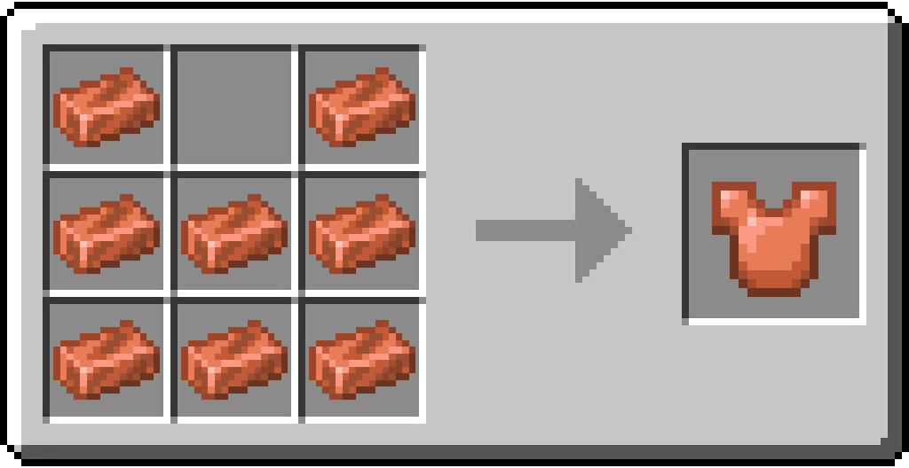

# Copper Chestplate

/// html | div[style="float: right; margin-left: .75rem;"]
<table>
  <thead>
    <tr>
      <th style="text-align: center;" colspan="2">Copper Chestplate</td>
    </tr>
  </thead>
  <tbody>
    <tr>
      <td colspan="2">
    </tr>
    <tr>
      <td>Durability</td>
      <td>180</td>
    </tr>
    <tr>
      <td>Armor</td>
      <td>6</td>
    </tr>
    <tr>
      <td>Stackable</td>
      <td>No</td>
    </tr>
  </tbody>
</table>
///

**Copper Chestplate** is a piece of armor that can be equipped by the player for extra protection.

When equipped will the armor provide 6 armor points of protection, which is equal to an Iron Chestplate.  
The armor comes at a reduced durability of 180, putting it below the Iron Chestplate with 240, but above the Golden Chestplate with 112 durability, making it an easy to obtain early game armor.

## Enchantments

The Item accepts any enchantment that Chestplates of different tiers can receive.

## Obtaining

### Crafting

| Ingredients  | Crafting recipe                                                                                |
|--------------|------------------------------------------------------------------------------------------------|
| Copper Ingot | { style="max-width: 75%" } |

## Data Values

### ID

| Name              | Identifier                      |
|-------------------|---------------------------------|
| Copper Chestplate | `vanillaplus:copper_chestplate` |