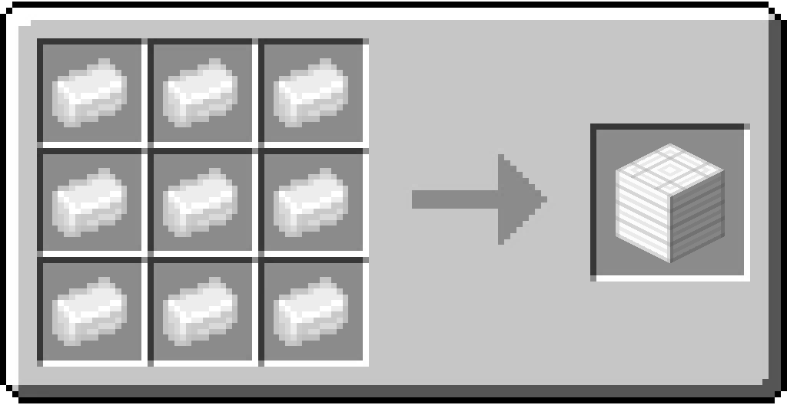

# Block of Aluminum

/// html | div[style="float: right; margin-left: .75rem;"]
<table>
  <thead>
    <tr>
      <th style="text-align: center;" colspan="2">Block of Aluminum</td>
    </tr>
  </thead>
  <tbody>
    <tr>
      <td colspan="2">
    </tr>
    <tr>
      <td>Renewable</td>
      <td>Yes</td>
    </tr>
    <tr>
      <td>Stackable</td>
      <td>Yes (64)</td>
    </tr>
    <tr>
      <td>Tool</td>
      <td>Iron Pickaxe</td>
    </tr>
    <tr>
      <td>Blast resistance</td>
      <td>5</td>
    </tr>
    <tr>
      <td>Hardness</td>
      <td>4</td>
    </tr>
  </tbody>
</table>
///

**Block of Aluminum** is a block crafted from [Aluminum Ingots](../items/aluminum_ingot.md).

The block can be placed at 3 orientations similar to Logs.

## Obtaining

### Crafting

| Ingredients                                  | Crafting recipe                                                                          |
|----------------------------------------------|------------------------------------------------------------------------------------------|
| [Aluminum Ingot](../items/aluminum_ingot.md) | { style="max-width: 75%" } |

## Data Values

### ID

| Name              | Identifier                   |
|-------------------|------------------------------|
| Block of Aluminum | `vanillaplus:aluminum_block` |