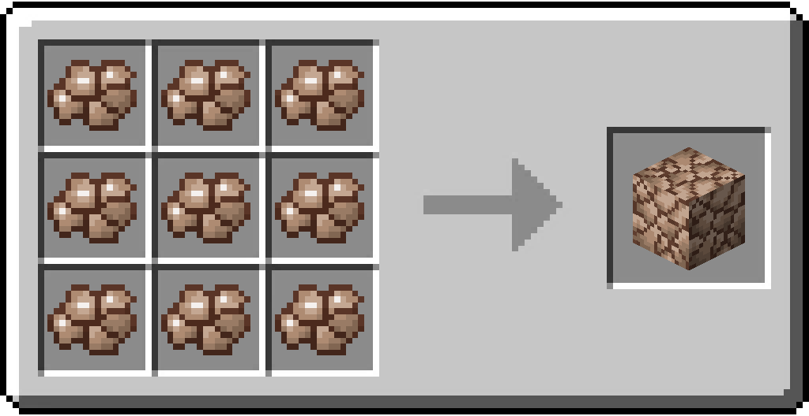

# Block of raw Bauxite

/// html | div[style="float: right; margin-left: .75rem;"]
<table>
  <thead>
    <tr>
      <th style="text-align: center;" colspan="2">Block of raw Bauxite</td>
    </tr>
  </thead>
  <tbody>
    <tr>
      <td colspan="2">
    </tr>
    <tr>
      <td>Renewable</td>
      <td>No</td>
    </tr>
    <tr>
      <td>Stackable</td>
      <td>Yes (64)</td>
    </tr>
    <tr>
      <td>Tool</td>
      <td>Iron Pickaxe</td>
    </tr>
    <tr>
      <td>Blast resistance</td>
      <td>5</td>
    </tr>
    <tr>
      <td>Hardness</td>
      <td>4</td>
    </tr>
  </tbody>
</table>
///

**Block of raw Bauxite** is a block crafted from [Raw Bauxite](../items/raw_bauxite.md).

## Obtaining

### Crafting

| Ingredients                            | Crafting recipe                                                                                |
|----------------------------------------|------------------------------------------------------------------------------------------------|
| [Raw Bauxite](../items/raw_bauxite.md) | { style="max-width: 75%" } |

## Data Values

### ID

| Name                 | Identifier                      |
|----------------------|---------------------------------|
| Block of raw Bauxite | `vanillaplus:raw_bauxite_block` |