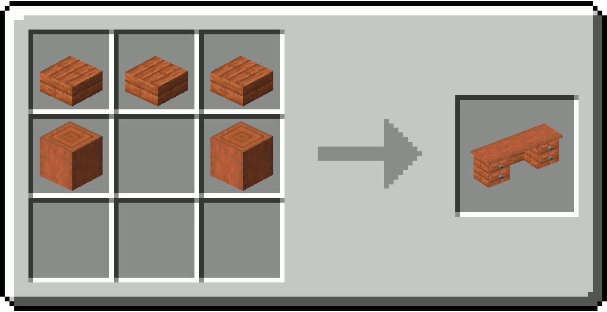

# Office Table

/// html | div[style="float: right; margin-left: .75rem;"]
<table>
  <thead>
    <tr>
      <th style="text-align: center;" colspan="2"><h2>Office Table</h2></td>
    </tr>
  </thead>
  <tbody>
    <tr>
      <td colspan="2">
    </tr>
    <tr>
      <td>Stackable</td>
      <td>Yes (64)</td>
    </tr>
  </tbody>
</table>
///

**Office Table** is a furniture that can be placed in the world to be used as a decorative piece.

The Item exists in all 12 wood types.

## Usage

The item can be placed on the ground by right-clicking with it.  
A free area of at least `1x3x1` (`LxWxH`) is required for the item to be placable.

## Obtaining

### Crafting

| Ingredients                                  | Crafting recipe                                                        |
|----------------------------------------------|------------------------------------------------------------------------|
| Matching Wooden Slab + Matching Stripped Log | { style="max-width: 75%" } |

## Data Values

### ID

| Name                   | Identifier                          |
|------------------------|-------------------------------------|
| Acacia Office Table    | `vanillaplus:acacia_office_table`   |
| Bamboo Office Table    | `vanillaplus:bamboo_office_table`   |
| Birch Office Table     | `vanillaplus:birch_office_table`    |
| Cherry Office Table    | `vanillaplus:cherry_office_table`   |
| Crimson Office Table   | `vanillaplus:crimson_office_table`  |
| Dark Oak Office Table  | `vanillaplus:dark_oak_office_table` |
| Jungle Office Table    | `vanillaplus:jungle_office_table`   |
| Mangrove Office Table  | `vanillaplus:mangrove_office_table` |
| Oak Office Table       | `vanillaplus:oak_office_table`      |
| Pale Oak Office Table  | `vanillaplus:pale_oak_office_table` |
| Spruce Office Table    | `vanillaplus:spruce_office_table`   |
| Warped Office Table    | `vanillaplus:warped_office_table`   |