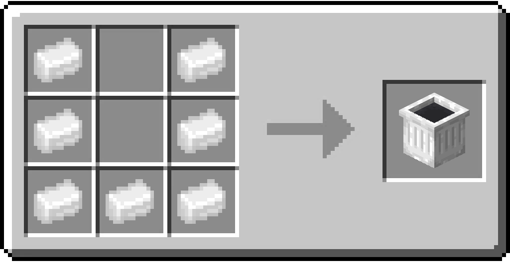

# Trashcan

/// html | div[style="float: right; margin-left: .75rem;"]
<table>
  <thead>
    <tr>
      <th style="text-align: center;" colspan="2">Trashcan</td>
    </tr>
  </thead>
  <tbody>
    <tr>
      <td colspan="2">
    </tr>
    <tr>
      <td>Stackable</td>
      <td>Yes (64)</td>
    </tr>
  </tbody>
</table>
///

**Trashcan** is a furniture that allows a player to open an inventory to dispose of items they no longer need.

## Usage

The item can be placed by right-clicking with it on the ground.

Interacting with the furniture through right-clicking it will open an inventory. Placing any items in said inventory and closing it aftwrwards destroys the Items.

## Obtaining

### Crafting

| Ingredients                                  | Crafting recipe                                                              |
|----------------------------------------------|------------------------------------------------------------------------------|
| [Aluminum Ingot](../items/aluminum_ingot.md) | { style="max-width: 75%" } |

## Data Values

### ID

| Name     | Identifier             |
|----------|------------------------|
| Trashcan | `vanillaplus:trashcan` |