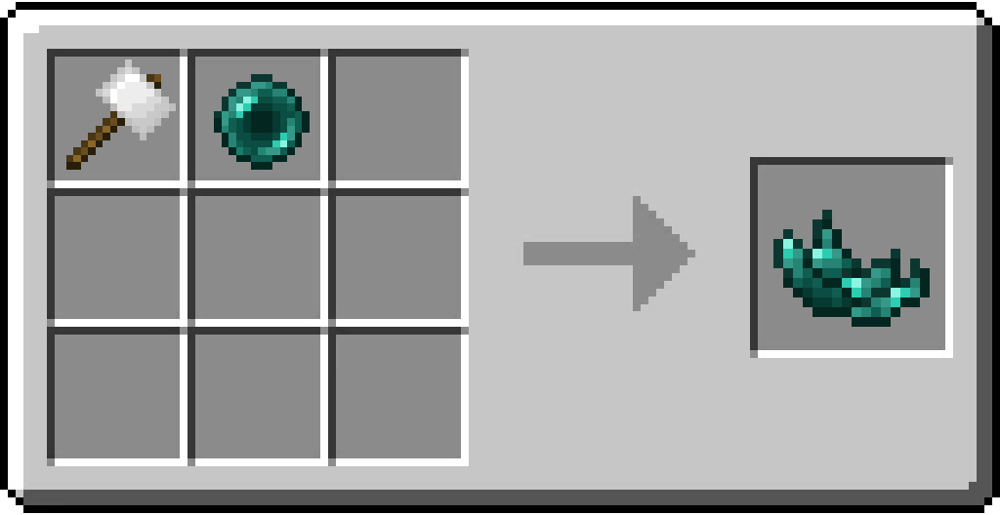

# Crushed Ender Pearl

/// html | div[style="float: right; margin-left: .75rem;"]
<table>
  <thead>
    <tr>
      <th style="text-align: center;" colspan="2">Crushed Ender Pearl</td>
    </tr>
  </thead>
  <tbody>
    <tr>
      <td colspan="2">
    </tr>
    <tr>
      <td>Stackable</td>
      <td>Yes (64)</td>
  </tbody>
</table>
///

**Crushed Ender Pearl** is an item used to craft the [Teleport Crystal](../tools/teleport_crystal.md).

## Obtaining

### Crafting

/// note | This recipe is Shapeless.
///

The Aluminum Hammer used will be returned in the Crafting Grid with one durability used.

| Ingredients                                         | Crafting recipe                                                                                    |
|-----------------------------------------------------|----------------------------------------------------------------------------------------------------|
| [Aluminum Hammer](aluminum_hammer.md) + Ender Pearl | { style="max-width: 75%" } |

## Data Values

### ID

| Name                | Identifier                        |
|---------------------|-----------------------------------|
| Crushed Ender Pearl | `vanillaplus:crushed_ender_pearl` |