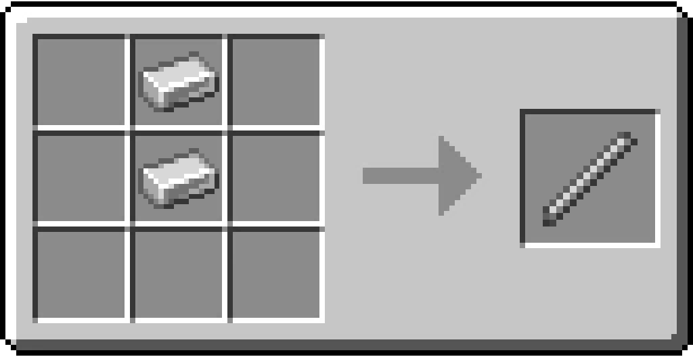

# Iron Rod

/// html | div[style="float: right; margin-left: .75rem;"]
<table>
  <thead>
    <tr>
      <th style="text-align: center;" colspan="2">Raw Bauxite</td>
    </tr>
  </thead>
  <tbody>
    <tr>
      <td colspan="2">
    </tr>
    <tr>
      <td>Stackable</td>
      <td>Yes (64)</td>
    </tr>
  </tbody>
</table>
///

**Iron Rod** is an item that can be crafted from 2 Iron Ingots.

## Usage

Iron Rods are used in crafting recipes for weapons such as the [Iron Bow](../weapons/iron_bow.md).

## Obtaining

### Crafting

| Ingredients | Crafting recipe                                                              |
|-------------|------------------------------------------------------------------------------|
| Iron Ingot  | { style="max-width: 75%" } |

## Data Values

### ID

| Name     | Identifier             |
|----------|------------------------|
| Iron Rod | `vanillaplus:iron_rod` |