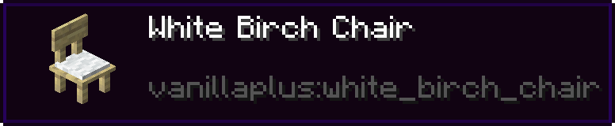

# WAILA

**WAILA** (**W**hat **a**m **I** **l**ooking **a**t) is a Server mechanic displaying information about the block the player is currently looking at.

## Usage

/// caption
    attrs: {class: "caption"}

An example of the WAILA display
///

By looking at a block, a Display at the top of the player's screen will display, providing information regarding the block such as its display name and its Namespaced ID.

## Commands

The `/waila` command can be used to enable or disable the WAILA Display.