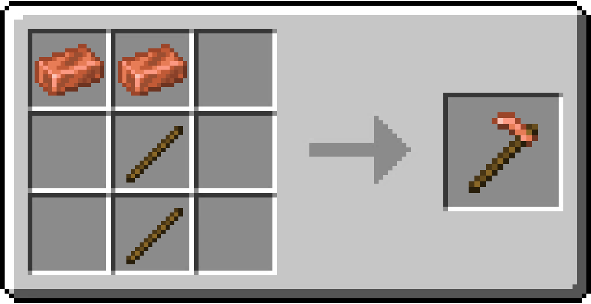

# Copper Hoe

/// html | div[style="float: right; margin-left: .75rem;"]
<table>
  <thead>
    <tr>
      <th style="text-align: center;" colspan="2">Copper Hoe</td>
    </tr>
  </thead>
  <tbody>
    <tr>
      <td colspan="2">
    </tr>
    <tr>
      <td>Durability</td>
      <td>190</td>
    </tr>
    <tr>
      <td>Stackable</td>
      <td>No</td>
    </tr>
  </tbody>
</table>
///

**Copper Hoe** is a tool that has the same features as other hoes of different materials.

## Obtaining

### Crafting

| Ingredients          | Crafting recipe                                                                  |
|----------------------|----------------------------------------------------------------------------------|
| Copper Ingot + Stick | { style="max-width: 75%" } |

## Data Values

### ID

| Name       | Identifier               |
|------------|--------------------------|
| Copper Hoe | `vanillaplus:copper_hoe` |