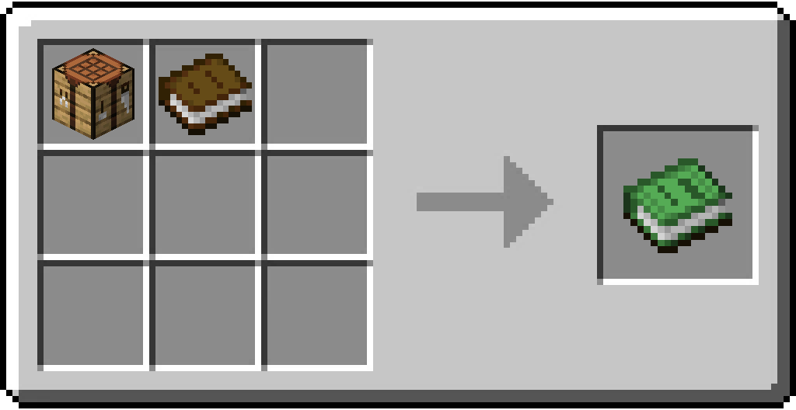

# Recipe Book

/// html | div[style="float: right; margin-left: .75rem;"]
<table>
  <thead>
    <tr>
      <th style="text-align: center;" colspan="2">Recipe Book</td>
    </tr>
  </thead>
  <tbody>
    <tr>
      <td colspan="2">
    </tr>
    <tr>
      <td>Durability</td>
      <td>190</td>
    </tr>
    <tr>
      <td>Stackable</td>
      <td>No</td>
    </tr>
  </tbody>
</table>
///

**Recipe Book** is an item that opens the recipes GUI.

## Usage

Right-clicking with the Item in hand will open the Recipes GUI, which lists all custom recipes for the crafting table, furnace, smithing table, as well as also depicting Mining information for blocks.

## Obtaining

### Crafting

/// note | This recipe is Shapeless.
///

| Ingredients           | Crafting recipe                                                                    |
|-----------------------|------------------------------------------------------------------------------------|
| Crafting Table + Book | { style="max-width: 75%" } |

## Data Values

### ID

| Name        | Identifier                |
|-------------|---------------------------|
| Recipe Book | `vanillaplus:recipe_book` |