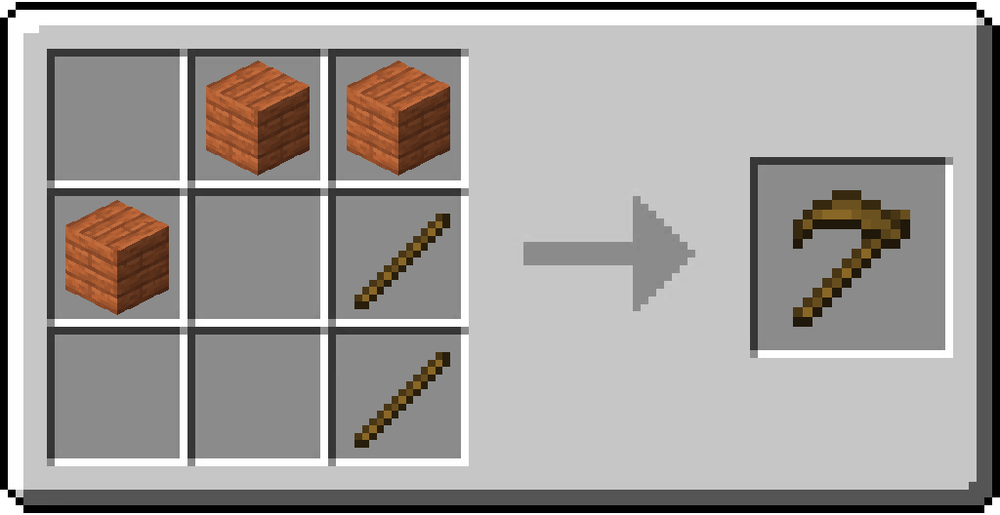
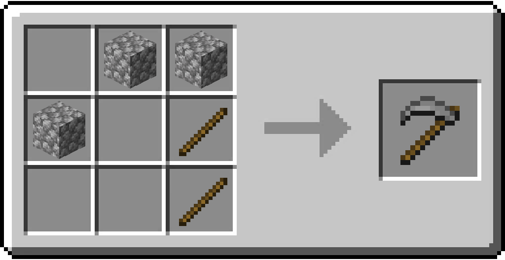
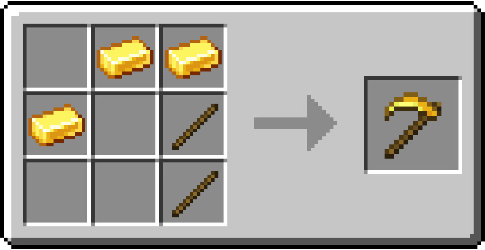
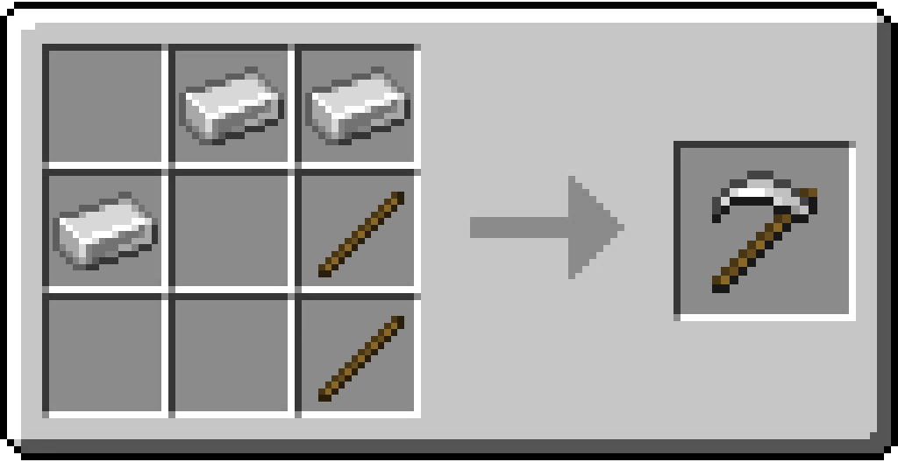
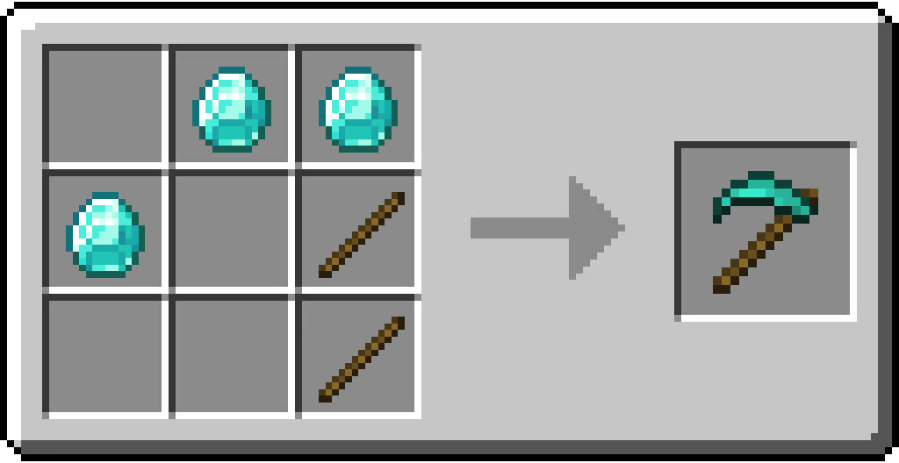

# Scythe

/// html | div[style="float: right; margin-left: .75rem;"]
<table>
  <thead>
    <tr>
      <th style="text-align: center;" colspan="2">Scythe</td>
    </tr>
  </thead>
  <tbody>
    <tr>
      <td colspan="2">
    </tr>
    <tr>
      <td>Durability</td>
      <td>Wood: 59 Stone: 131 Gold: 32 Copper: 190 Iron: 250 Diamond: 1561 Netherite: 2031</td>
    </tr>
    <tr>
      <td>Stackable</td>
      <td>No</td>
    </tr>
  </tbody>
</table>
///

**Scythe** is a tool that allows you to harvest multiple crops simultaneously.

## Usage

Harvesting any crops (Wheat, Carrots, Potatoes, etc.) with the Scythe will also harvest any mature crop in the surrounding 8 blocks of the harvested crop, allowing the player to farm a `3x3` area with a single use of the Scythe.

### List of Harvestable Blocks

| Block          | Notes                            |
|----------------|----------------------------------|
| Beetroot       | Only harvested once fully grown. |
| Brown Mushroom |                                  |
| Carrot         | Only harvested once fully grown. |
| Potato         | Only harvested once fully grown. |
| Red Mushroom   |                                  |
| Short Grass    |                                  |
| Tall Grass     |                                  |
| Wheat          | Only harvested once fully grown. |

## Obtaining

### Crafting

| Ingredients                    | Crafting recipe                                                                          |
|--------------------------------|------------------------------------------------------------------------------------------|
| Matching Wooden Planks + Stick | { style="max-width: 75%" }   |
| Cobblestone + Stick            | { style="max-width: 75%" }     |
| Gold Ingot + Stick             | { style="max-width: 75%" }   |
| Copper Ingot + Stick           | { style="max-width: 75%" }   |
| Iron Ingot + Stick             | { style="max-width: 75%" }       |
| Diamond + Stick                | { style="max-width: 75%" } |

### Smithing

A Netherite Scythe can be crafted in a Smithing table by placing a Diamond Scythe alongside a Netherite Ingot and a Netherite Upgrade Template in it.

## Data Values

### ID

| Name             | Identifier                     |
|------------------|--------------------------------|
| Wooden Scythe    | `vanillaplus:wooden_scythe`    |
| Stone Scythe     | `vanillaplus:stone_scythe`     |
| Golden Scythe    | `vanillaplus:_scythe`          |
| Copper Scythe    | `vanillaplus:copper_scythe`    |
| Iron Scythe      | `vanillaplus:iron_scythe`      |
| Diamond Scythe   | `vanillaplus:diamond_scythe`   |
| Netherite Scythe | `vanillaplus:netherite_scythe` |